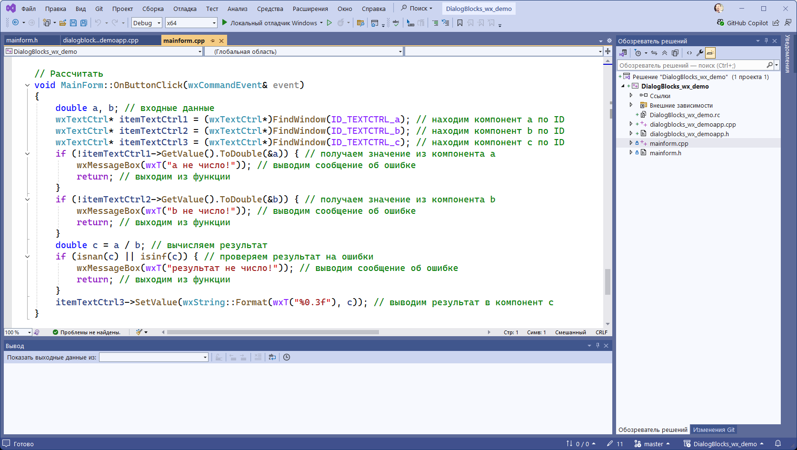

# DialogBlocks_MSVS2022_wx_demo
Пример программы на C++ с использованием wxWidgets и DialogBlocks в Visual Studio 2022




**WXWIN:** D:\Development\CPP\wxWidgetsDBls

**DBPROJECTS:** D:\Projects\DialogBlocksProjects

**MSBUILDDIR:** C:\Program Files\Microsoft Visual Studio\2022\Community\MSBuild\Current\Bin

**MSVCDIR:**

* *Для сборки wxWidgets:* C:\Program Files\Microsoft Visual Studio\2022\Community\VC\Tools\MSVC\14.37.32822

* *Для сборки и запуска программ:* C:\Program Files\Microsoft Visual Studio\2022\Community

**PLATFORMSDK:** C:\Program Files (x86)\Windows Kits\10


**VC++ version:** 17

**VC++ tools version:** 17.7.6

**Full Platform SDK version**: 10.0.22621.0

**Message encoding:** cp866


```
void MainForm::OnButtonClick(wxCommandEvent& event)
{
	double a, b; // входные данные
	wxTextCtrl* itemTextCtrl1 = (wxTextCtrl*)FindWindow(ID_TEXTCTRL_a); // находим компонент a по ID
	wxTextCtrl* itemTextCtrl2 = (wxTextCtrl*)FindWindow(ID_TEXTCTRL_b); // находим компонент b по ID
	wxTextCtrl* itemTextCtrl3 = (wxTextCtrl*)FindWindow(ID_TEXTCTRL_c); // находим компонент c по ID
	if (!itemTextCtrl1->GetValue().ToDouble(&a)) { // получаем значение из компонента a
		wxMessageBox(wxT("a is not a number")); // выводим сообщение об ошибке
		return; // выходим из функции
	}
	if (!itemTextCtrl2->GetValue().ToDouble(&b)) { // получаем значение из компонента b
		wxMessageBox(wxT("b is not a number")); // выводим сообщение об ошибке
		return; // выходим из функции
	}
	double c = a / b; // вычисляем результат
	if (isnan(c) || isinf(c)) { // проверяем результат на ошибки
		wxMessageBox(wxT("c is not a number")); // выводим сообщение об ошибке
		return; // выходим из функции
	}
	itemTextCtrl3->SetValue(wxString::Format(wxT("%0.3f"), c)); // выводим результат в компонент c
}
```


http://www.anthemion.co.uk/dialogblocks/

https://www.wxwidgets.org/

https://visualstudio.microsoft.com/ru/vs/community/

http://www.anthemion.co.uk/dialogblocks/ImageBlocks-1.06-Setup.exe
